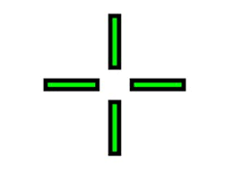

# AFPSHUD
HUD with dynamic crosshair. It is used by [FpsCharacter](./FpsCharacter.md).

# Index
- [Tutorial](#_Tutorial)
- [Technical reference](#_Technical_reference)
- [How to guide](#_How_to_Guide)

# Tutorial
## Step 1. Create a new `FpsHud` BP
1. Create a new Blueprint inherits FPSHUD at `C++ class/FPS`.
2. Set `Corsshair texture`.
    - Crosshair is composed of 4 items. The texture is for those items. Please upload bottom texture only. FPSHUD makes them attaching your texture and rotate automatically.
    - example
        - Correct texture -> 
        - Wrong texture -> 
3. Set `Default Widget`

# Technical_reference
- Type : Blueprint HUD
- Path : `MyContent/UI/FpsHud`
    - `BP_FpsHud` : HUD for FPSCharacter

# How_to_Guide
